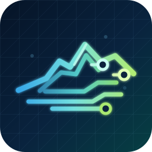

# Northstar Guard

<strong>Lightweight. Local-first. Explainable.</strong> Focused security monitoring for macOS, Apple Silicon, Fedora COSMIC, headless Linux, and Windows.

  
  
  

Northstar Guard is a clean-room, monitor-only security toolkit. It checks high-value locations, explains why an item was reported, writes timestamped Markdown reports, and leaves remediation decisions with the operator. It is designed to complement the platform’s built-in security controls—not pretend to be a commercial antivirus replacement.

> **Built with open source · Powered by GitHub · Runs on macOS · Runs on Rocky Linux**

## Platform packages

| Platform | Package | Install |
| --- | --- | --- |
| Intel macOS | [macos/](macos/) | `zsh macos/install-northstar-guard.sh` |
| Apple Silicon macOS | [macos/apple-silicon/](macos/apple-silicon/) | `zsh macos/apple-silicon/install-northstar-guard.sh` |
| Fedora COSMIC | [fedora-cosmic/](fedora-cosmic/) | `bash fedora-cosmic/install.sh` |
| Headless Linux / Rocky Linux | [server-headless/](server-headless/) | `sudo bash server-headless/install.sh` |
| Windows 10 / 11 / Server | [windows/](windows/) | `powershell -ExecutionPolicy Bypass -File windows/install-northstar-guard.ps1` |

Each package has its own README and installer. Installers use the current user or service account and do not assume a private username, network, or fleet.

## Why Northstar Guard

- **Focused by default:** scans the locations most likely to matter without crawling an entire disk.
- **Low overhead:** paced monitors and bounded file sizes keep resource use predictable.
- **Readable evidence:** timestamped Markdown reports include scope, engines, findings, recommendations, and data gaps.
- **Operator controlled:** trust known-good findings explicitly; nothing is silently deleted or quarantined.
- **Native where it matters:** AppKit on macOS, native ARM64 builds on Apple Silicon, GTK on Fedora COSMIC, systemd for servers, and PowerShell/WinForms on Windows.

## What it scans

Northstar uses focused, configurable scopes rather than crawling every file on a computer. Depending on the platform, coverage includes user Downloads/Desktop/Documents, temporary directories, startup and persistence locations, local executable paths, and selected system service locations. Large files, hidden package descendants, and missing paths are bounded or skipped as documented by each package.

Detection is evidence-based and monitor-only: downloaded executable heuristics, quarantine metadata, misleading extensions, platform signature validation, persistence baselines, YARA rules, and optional ClamAV integration for the headless Linux package. It does not delete or quarantine files automatically.

## Reports and trusted findings

Reports are timestamped Markdown with an executive summary, scan coverage, findings, recommendations, and data gaps. Operators can explicitly mark known-good findings as trusted. Trust is a local allow-list decision, not a malware verdict.

## Product visuals

The repository includes representative product assets in each platform package:

- Fedora COSMIC UI: [`fedora-cosmic/northstar-guard-cosmic.png`](fedora-cosmic/northstar-guard-cosmic.png)
- Headless Linux terminal: [`server-headless/northstar-server-terminal.png`](server-headless/northstar-server-terminal.png)
- macOS product icon: [`macos/Assets/NorthstarGuardIcon.icns`](macos/Assets/NorthstarGuardIcon.icns)
- Windows product icon: [`windows/NorthstarGuard.ico`](windows/NorthstarGuard.ico)

Private fleet dashboards, live reports, screenshots, hostnames, and infrastructure details are intentionally not part of this public release.

## Building and testing

Install the platform’s normal build prerequisites, then use the package README and build scripts. The Apple Silicon package compiles native `arm64` binaries and adds read-only Apple platform posture checks such as FileVault, SIP, Gatekeeper, and Secure Enclave service presence.

The update tooling in [`macos/update-channel/`](macos/update-channel/) creates and verifies versioned source bundles. It does not contain fleet credentials or deployment configuration.

## Security and privacy

See [SECURITY.md](SECURITY.md). Do not place API keys, OAuth credentials, SSH keys, private certificates, production hostnames, private reports, or personal data in issues, pull requests, screenshots, or this repository.

Northstar Guard is released under the Apache-2.0 license.

