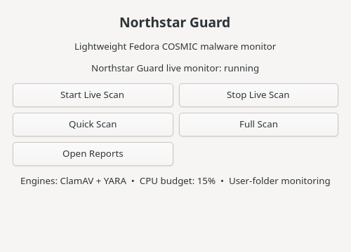

# Northstar Guard for Fedora COSMIC

This package is maintained in the dedicated [Northstar Guard repository](../README.md). It installs into the invoking user’s home directory and does not assume a user named `ray`.

Northstar Guard is a small, local-first malware monitor for Fedora COSMIC. It
uses the installed ClamAV signature scanner and YARA rules, watches the user’s
high-value folders with inotify, and provides the same controls from a CLI and
a simple GTK4 desktop window. It is a review and reporting tool, not a
commercial antivirus replacement and it does not automatically delete files.



## Install

From this directory on the Fedora laptop:

```sh
sudo dnf install gcc gtk4-devel pkgconf-pkg-config clamav yara inotify-tools
./install.sh
```

The installer enables a user systemd service with `CPUQuota=12%`, `MemoryMax=256M`,
low priority, and no elevated privileges. The live monitor remains scoped to
`~/Downloads`, `~/Desktop`, `~/Documents`, and `~/.config/autostart`. It scans
on completed writes or moves instead of polling the whole disk. Each live
ClamAV invocation has a 45-second ceiling so a problematic file cannot pin the
monitor indefinitely.

## CLI

```text
northstar-guard status
northstar-guard start|stop
northstar-guard scan quick
northstar-guard scan full
northstar-guard scan path /path/to/file-or-folder
northstar-guard findings
northstar-guard trust add /path/to/file
northstar-guard trust remove /path/to/file
northstar-guard trust list
```

Quick scans cover user download, document, desktop, autostart, and local-bin
areas. Full scans add `/tmp`, `/var/tmp`, `/usr/local/bin`, `/usr/local/sbin`,
systemd unit files, cron directories, and system desktop autostart files.

Findings and timestamped Markdown reports are stored under
`~/.local/share/northstar-guard/`. Trust entries contain both the path and its
SHA-256 hash; changing a trusted file causes it to be scanned again.

## GUI

Launch **Northstar Guard** from COSMIC’s app library or run
`northstar-guard-ui`. The window offers Live Scan Start/Stop, Quick Scan, Full
Scan, and Open Reports. The service can continue monitoring after the window
is closed and can be controlled from the CLI.

## Engines and limits

- ClamAV supplies the signature database; `freshclam` may continue updating it.
- The bundled YARA rules flag a small set of high-signal shell persistence and
  download/execute patterns for review.
- No kernel-level blocking, quarantine, or automatic remediation is enabled.
- The report’s executive summary is deterministic and states exactly what was
  scanned, which engines ran, and how many findings were recorded.
