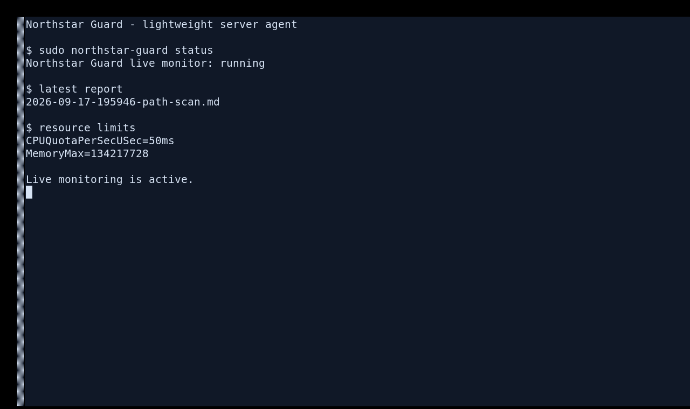

# Northstar Guard — lightweight server agent

This package is maintained in the dedicated [Northstar Guard repository](../README.md). The system service watches `/home` so it works across server accounts rather than assuming a user named `ray`.

This headless build is intended for servers, exit-node VMs, and other machines without a desktop session. It installs one systemd service with no GUI, watches only high-value user, temporary, persistence, and local executable paths, and keeps resource limits low (`CPUQuota=5%`, `MemoryMax=256M`).



The live monitor checks files as they are created or changed with the bundled YARA rules and ClamAV. When a reachable `clamd` service is present, Northstar uses `clamdscan` so the signature database is shared outside the agent cgroup; otherwise it falls back to bounded `clamscan` subprocesses. On-demand scans are available for the same focused areas:

```bash
sudo northstar-guard status
sudo northstar-guard start
sudo northstar-guard stop
sudo northstar-guard scan quick
sudo northstar-guard scan full
sudo northstar-guard scan path /path/to/file
sudo northstar-guard findings
```

Reports and the executive summary are written as timestamped Markdown files under `/var/lib/northstar-guard/reports`. The agent does not scan an entire filesystem by default. It watches `/home` (covering users on the server), `/tmp`, `/var/tmp`, `/etc/systemd/system`, `/etc/cron.d`, `/etc/cron.daily`, `/usr/local/bin`, and `/usr/local/sbin`; missing paths are skipped.

The installer disables legacy Maldet/LMD service and timer hooks while leaving ClamAV definition updates available where ClamAV is installed. It does not add or modify any GitHub Actions workflow.
